# Kubernetes - Keycloak - Crossplane - OIDC login

In this document we learn how to use Crossplane to manage Keycloak resources and use Keycloak for Kubernetes oidc Authentication.

## LDAP Installation

In this guide, we want to integrate LDAP with Keycloak, so users from LDAP can authenticate to k8s.

Here you can find document of openLDAP installation and configuration:

[opemLDAP installation](https://github.com/kaviankarimzadeh/openldap-example.git)


## Keycloak Installation

Here we use Helm to install keycloak and override some values via our custom values file.
```
{
    wget https://charts.bitnami.com/bitnami/keycloak-21.4.1.tgz
    tar xzvf keycloak-21.4.1.tgz
    rm -f keycloak-21.4.1.tgz
    cd keycloak
}

# You can use keycloak-values.yaml in the current repository:

helm -n keycloak install keycloak --values ./values.yaml --values ./keycloak-values.yaml . --create-namespace
```

## Crossplane Installation

Here we use Helm to install Crossplane and override some values via our custom values file.

```
{
    wget https://charts.crossplane.io/master/crossplane-1.17.0-rc.0.202.g26107bd6.tgz
    tar xzvf crossplane-1.17.0-rc.0.202.g26107bd6.tgz
    rm -f crossplane-1.17.0-rc.0.202.g26107bd6.tgz
    cd crossplane
}

# You can use crossplane-values.yaml in the current repository:

helm -n crossplane-system install crossplane --values ./values.yaml --values ./crossplane-values.yaml . --create-namespace
```

Next step is to put Keycloak credential as Kubernetes secret:

```
printf '%s' '{
    "client_id":"admin-cli",
    "username": "user",
    "password": "securepassword",
    "url": "https://keycloak.example.com",
    "realm": "master"
}' > keycloak-crossplane.yaml
```
```
kubectl -n crossplane-system create secret generic keycloak-crossplane --from-file=keycloakCredentials=./keycloak-crossplane.yaml
```

And finally, we need to create a Crossplane ProviderConfig for Keycloak:
```
cat <<EOF > keycloak-provider-config.yaml
apiVersion: keycloak.crossplane.io/v1beta1
kind: ProviderConfig
metadata:
  name: keycloak-provider-config
spec:
  credentials:
    secretRef:
      key: keycloakCredentials
      name: keycloak-crossplane
      namespace: crossplane-system
    source: Secret
EOF
```

```
kubectl -n crossplane-system create -f keycloak-provider-config.yaml
```

## Creating Keycloak resources via Crossplane:

For this matter, we use [Keycloak Provider](https://marketplace.upbound.io/providers/crossplane-contrib/provider-keycloak/v0.21.0)

### Realm
First of all we need to create a custom Realm (optional):

```
{
    cd crossplane
    kubectl -n crossplane create -f 01-realm.yaml
}
```
Now you can see a new Realm in UI:

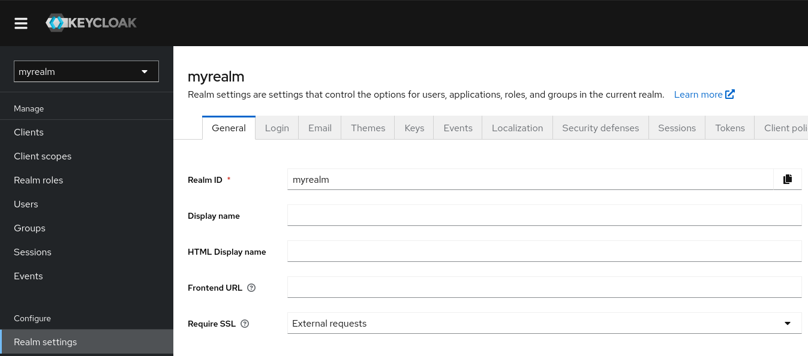


### Client
Next step is to creste a client for Kubernetes:
```
{
    cd crossplane
    kubectl -n crossplane create -f 02-client.yaml
}
```
And client is added and visible in UI:
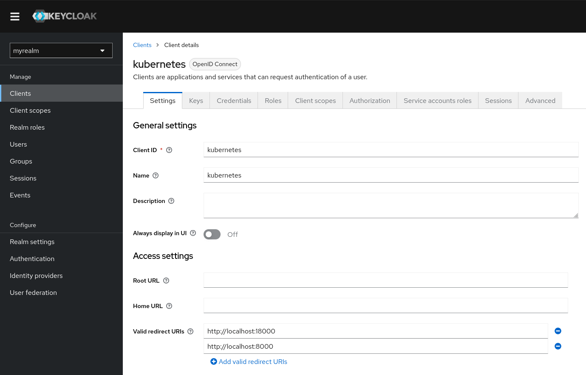


### Client Role
Now we can create different Client Role which then can be mapped to LDAP groups:
for example here we create two different Roles as `admin` and `viewer`:

```
{
    cd crossplane
    kubectl -n crossplane create -f 03-client-role.yaml
}
```

And we can verify from the UI:

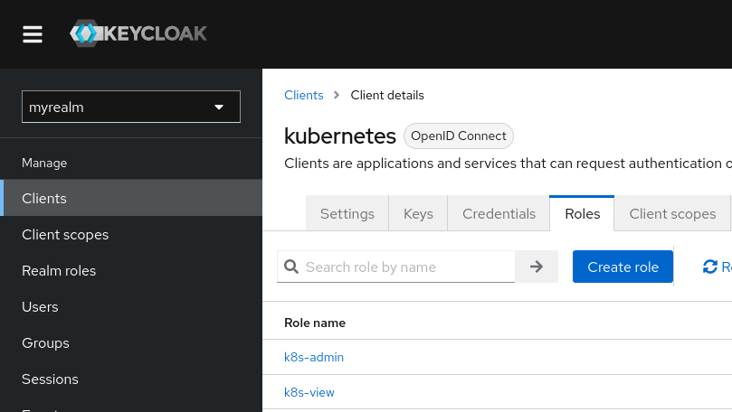


### Protocol Mapper
Next step is to create Protocol Mapper which are the client scope mappers that are required for Kubernete client:

```
{
    cd crossplane
    kubectl -n crossplane create -f 04-protocol-mapper.yaml
}
```

Verifying from the UI:

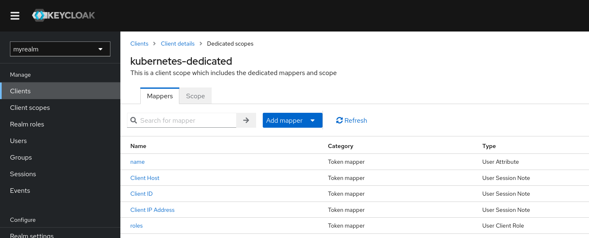


### Adding User Federation (LDAP)

It's time to add LDAP as user federation:

First we need to store bindDN password as Kubernetes secret:

```
cat <<EOF > ldap-password.yaml
apiVersion: v1
kind: Secret
metadata:
  name: ldap-password
type: Opaque
stringData:
  password: "ldapsecurepassword"
EOF
```

```
kubectl -n crossplane-system create -f ldap-password.yaml
```

Now we can add User Federation to integrate LDAP with Keycloak:

```
{
    cd crossplane
    kubectl -n crossplane create -f 05-user-federation.yaml
}
```

<span style="color:red;">**Important:
Make sure to configure the following values based on your LDAP users settings:

`usernameLdapAttribute: "uid"`

`rdnLdapAttribute: "uid"`

`uuidLdapAttribute: "entryUUID"`

`userObjectClasses: ["inetOrgPerson", "shadowAccount"]`

<span style="color:green;">**For example for Active Directory it can be:

`usernameLdapAttribute: "sAMAccountName"`

`rdnLdapAttribute: "cn"`

`uuidLdapAttribute: "sAMAccountName"`

`userObjectClasses: ["person", "organizationalPerson", "user"]`

Also here and based on provided details for my users in OpenLDAP I had to change `LDAP Attribute` for username mapper to `uid` in order to fetch users from LDAP. (by default it was `sAMAccountName`)


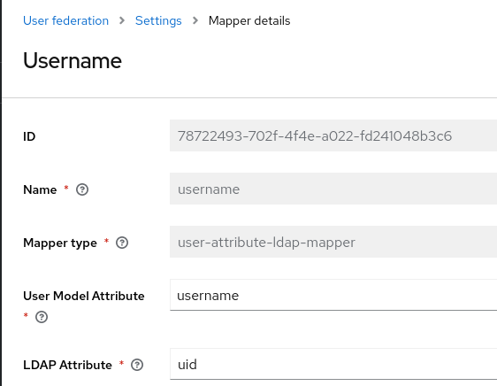

Ok now it's time to verify users in UI:

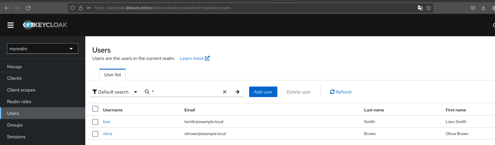


### Adding Parent Internal Group
In this example, I want to add LDAP groups and automatically map the appropriate client roles to them. Since it's not possible to sync LDAP groups directly, we need to use a Group LDAP mapper (next step). This allows us to create an internal group with an assigned client role and then add our LDAP groups to this internal group. In this way, the child LDAP groups will inherit the client roles from their parent group.


```
{
    cd crossplane
    kubectl -n crossplane create -f 06-internal-groups.yaml
}
```

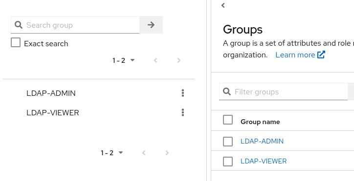


### Mapping Client Roles to the Parent Internal Groups

Now it's time to map our client role to our internal group we just created in last section: 

```
{
    cd crossplane
    kubectl -n crossplane create -f 07-role-mapper.yaml
}
```

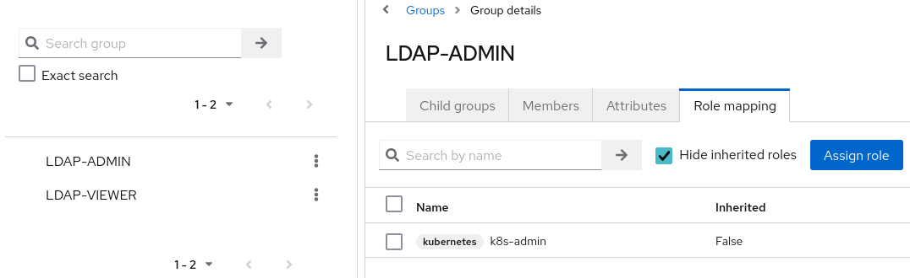


### Syncing LDAP groups into Keycloak

In this step we need to use LDAP Group Mapper in order to fetch LDAP groups. Here we use `groupsPath` to assign LDAP groups to our internal Groups we created before:

```
{
    cd crossplane
    kubectl -n crossplane create -f 08-ldap-group-mappers.yaml
}
```

<span style="color:red;">**Important: Agian it's important to replace the following configurations based on your LDAP settings:

`groupNameLdapAttribute: "cn"`

`groupObjectClasses: ["groupOfNames"]`

`membershipLdapAttribute: "member"`

`membershipAttributeType: "DN"`

`membershipUserLdapAttribute: "memberOf"`

`memberofLdapAttribute: "memberOf"`

<span style="color:green;">** For example for Active Directory you can use the followng settings:

`groupNameLdapAttribute: "cn"`

`groupObjectClasses: ["group"]`

`membershipLdapAttribute: "member"`

`membershipAttributeType: "DN"`

`membershipUserLdapAttribute: "sAMAccountName"`

`memberofLdapAttribute: "memberOf"`


<span style="color:red;">**Important: Syncing LDAP groups must be triggered via UI!

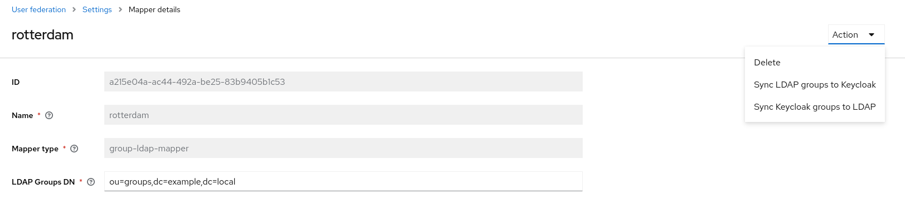

Verifying added groups and it's users:

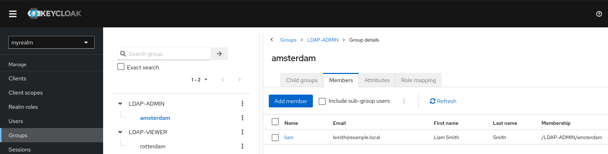


#Also we can verify form UI that memberOf is enabled on users:

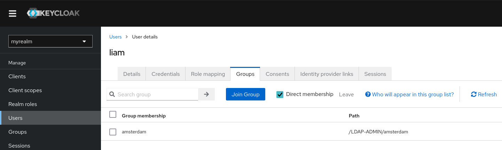


### Checking user info to see assigned role:


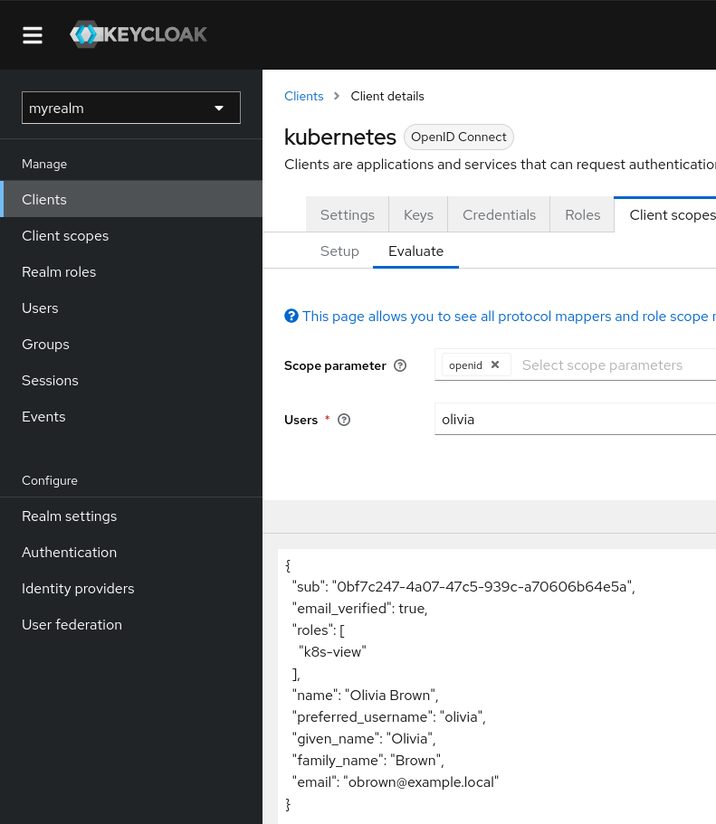

## RBAC Configuration and check access based on Keycloak defined Role:

#### Create RBAC for Admin and View access:

```
{
    cd rbac
    kubectl create -f admin.yaml
    kubectl create -f view.yaml
}
```

#### Add Issuer configurations into kube-apiserver file:
```
vi /etc/kubernetes/manifests/kube-apiserver.yaml

    - --oidc-client-id=kubernetes
    - --oidc-groups-claim=roles
    - --oidc-issuer-url=https://keycloak.example.com/realms/myrealm
    - --oidc-username-claim=name
    - --oidc-username-prefix=-
```

#### Prepare Kubeconfig with oidc:

```
apiVersion: v1
.
.
.
users:
- name: oidc
  user:
    exec:
      apiVersion: client.authentication.k8s.io/v1beta1
      args:
      - oidc-login
      - get-token
      - --oidc-issuer-url=https://keycloak.example.com/realms/myrealm
      - --oidc-client-id=kubernetes
      - --oidc-client-secret=<> # get this valuse from kubernete client in Keycloak credentials tab
      command: kubectl
      env: null
      interactiveMode: IfAvailable
      provideClusterInfo: false
```

#### Download and install kube login
https://github.com/int128/kubelogin

#### Testing our access:

#First check admin user (liam) who should have admin access:

```
kubectl get pods -A --kubeconfig kubeconfig 
NAMESPACE           NAME                                                              READY   STATUS    RESTARTS        AGE
cert-manager        cert-manager-67bf86b588-mlc2m                                     1/1     Running   0               23h
cert-manager        cert-manager-cainjector-8888d767b-8mstl                           1/1     Running   0               24h
cert-manager        cert-manager-webhook-75467474f4-fhq4n                             1/1     Running   0               24h
crossplane-system   crossplane-6fbdd6f59c-pplqf                                       1/1     Running   0               19h
crossplane-system   crossplane-contrib-provider-keycloak-1938b13eb3a5-9b5868f98wmml   1/1     Running   0               19h
crossplane-system   crossplane-rbac-manager-679db9bbb7-x567x                          1/1     Running   0               19h
ingress-nginx       ingress-nginx-controller-b9rgm                                    1/1     Running   0               24h
ingress-nginx       ingress-nginx-controller-mxvws                                    1/1     Running   0               24h
ingress-nginx       ingress-nginx-controller-qq66q                                    1/1     Running   0               24h

```

#Next check viwer user (olivia) who should have limited access:
```
kubectl get ingress -A --kubeconfig kubeconfig
Error from server (Forbidden): ingresses.networking.k8s.io is forbidden: User "Olivia Brown" cannot list resource "ingresses" in API group "networking.k8s.io" at the cluster scope
```

